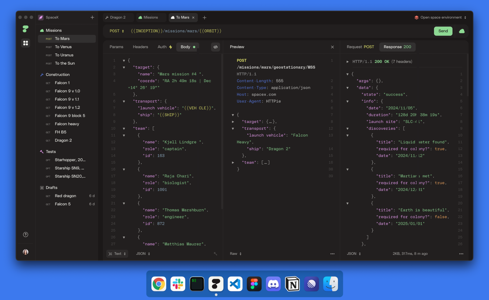

)

# HTTPie for Desktop

In this repository, we publish [releases](https://github.com/httpie/desktop/releases) of [HTTPie for Desktop](https://httpie.io/product) for Mac, Windows, and Linux. 

The app continuously auto-updates after the initial installation. 

[What’s new →](https://httpie.io/blog)

## Mac & Windows

[httpie.io/download →](https://httpie.io/download)

## Linux

Please follow the instructions below to install HTTPie for Desktop on Linux. 

The Linux package uses [AppImage](https://appimage.org/), and you need to install it using [AppImageLauncher](https://github.com/TheAssassin/AppImageLauncher) for the app to work:

1. Install [AppImageLauncher](https://github.com/TheAssassin/AppImageLauncher) ([instructions](https://github.com/TheAssassin/AppImageLauncher#system-wide-installation))
2. Download `HTTPie-*.AppImage` (or `HTTPie-*arm64.AppImage` for ARM64 architecture) from [the latest release](https://github.com/httpie/desktop/releases/latest) page
3. Run `$ AppImageLauncher HTTPie-*.AppImage`
